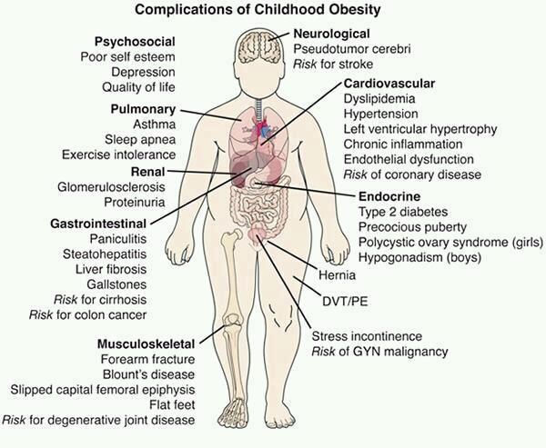
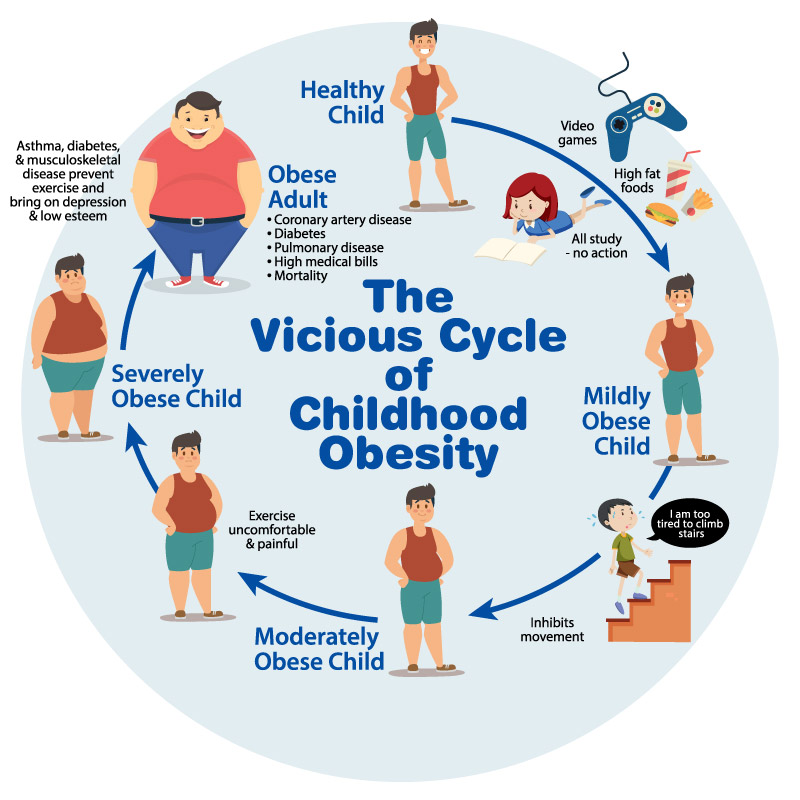
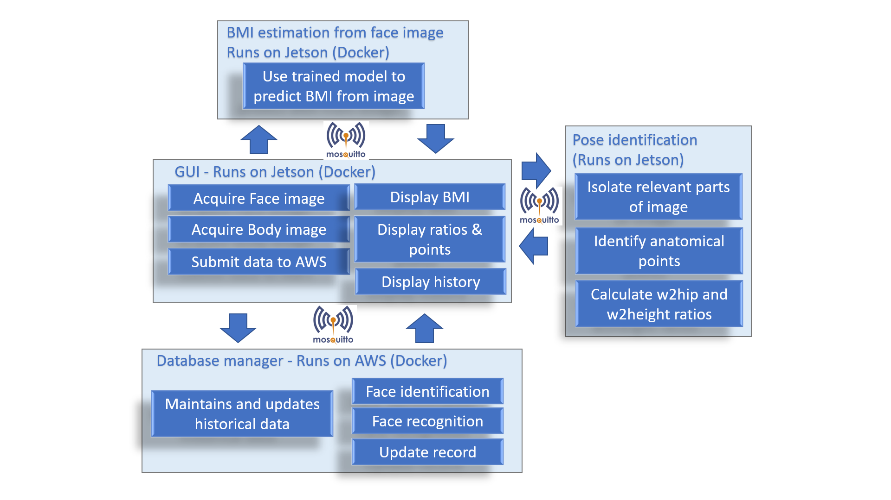

# [W251](https://github.com/MIDS-scaling-up/v2 "W251 Fall 2020")-Final-project-Weight-watchers

By Linda Yang, Rong Yang, Karen Liang and Jaime Heiss. This project combine face recognition, pose recognition, stereo imaging and BMI estimation to predict risk of obesity from stereo images at the edge. 

## Rationale

From Mayo Clinic: *"Obesity is a complex disease involving an excessive amount of body fat. Obesity isn't just a cosmetic concern. It is a medical problem that increases your risk of other diseases and health problems, such as heart disease, diabetes, high blood pressure and certain cancers. "*

### Obesity is trending upwards

## Aim: Quantitative metric of obesity risk for a given population by periodic assessment of image-based BMI combined with stereo measurements of anatomical features. 

Our goal is to provide accurate information to stake holders (school principal, school board, pediatricians and nutricionists) about whether the risk of obesity is increasing or decreasing in a given population by daily monitoring, in an anonimous and private way, the changes in risk level in order to allow decision makers to take action and evaluate past actions toward breaking the cycle of obesity.

## Approach:
Weight watcher is a system for long term monitoring of weight and obesity risk. It runs two local machine learning models to estimate Body Mass Index (MBI) from face images and detects anatomical points and hip to waist and waist to height ratios, which are relevant metrics to predict obesity risk. The system uses NVDIA Jeston Xavier NX and a USB camera at the edge and AWS cloud services. In adition to the local ML models, a third model for face recognition runs in the cloud to identify if a subject has been recorded previously and report historical data from a subject, wich is stored in a S3 bucket. A GUI allows acquisition of face and full body images which are sent to these 3 ML models as a message using MQTT protocol, and in turn each model returns also a message with the BMI estimation, identification of anatomical points and ratios and historical data of the subject, which are displayed by the GUI.

The system can be easily scalable as each edge device perform most of the work independently and the database manager that runs in the cloud can handle messages coming from different devices (for example to asses the eficacy of nutrition policies in all schools within a district or state). Other use case (with some modifications) is to anonimously determine BMI of clients in supermarkets and clothing stores to adjust inventory accordingly.

