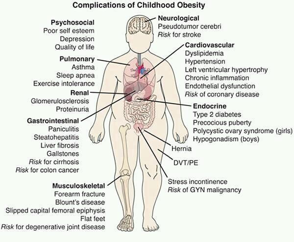
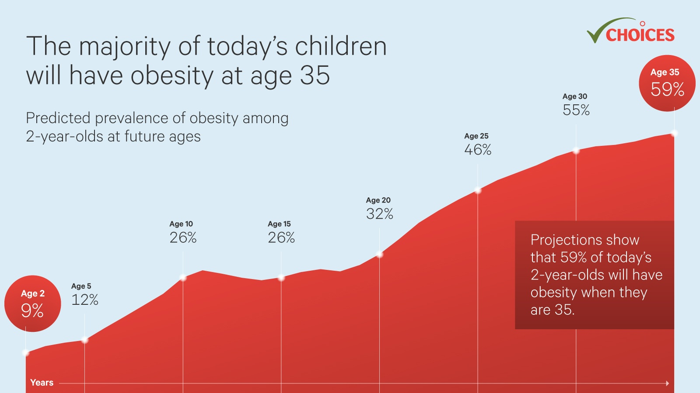
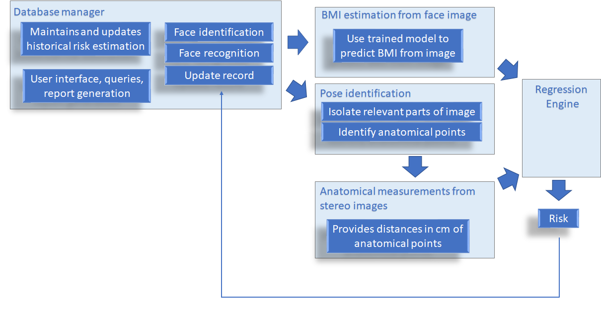

# [W251](https://github.com/MIDS-scaling-up/v2 "W251 Fall 2020")-Final-project-Weight-watchers

By Linda Yang, Rong Yang, Karen Liang and Jaime Heiss. This project combine face recognition, pose recognition, stereo imaging and BMI estimation to predict risk of obesity from stereo images at the edge. 

## Rationale

From Mayo Clinic: *"Obesity is a complex disease involving an excessive amount of body fat. Obesity isn't just a cosmetic concern. It is a medical problem that increases your risk of other diseases and health problems, such as heart disease, diabetes, high blood pressure and certain cancers. "*

### Obesity is trending upwards

## Aim: Quantitative metric of obesity risk for a given population by periodic assessment of image-based BMI combined with stereo measurements of anatomical features. 

Our goal is to provide accurate information to stake holders (school principal, school board, pediatricians and nutricionists) about whether the risk of obesity is increasing or decreasing in a given population by daily monitoring, in an anonimous and private way, the changes in risk level in order to allow decision makers to take action and evaluate past actions toward breaking the cycle of obesity.

## Approach:
A database manager running in the cloud or locally in the Nvidia Jetson NX reads images, identify new vs existing records and executes the obesity risk assesment program.

