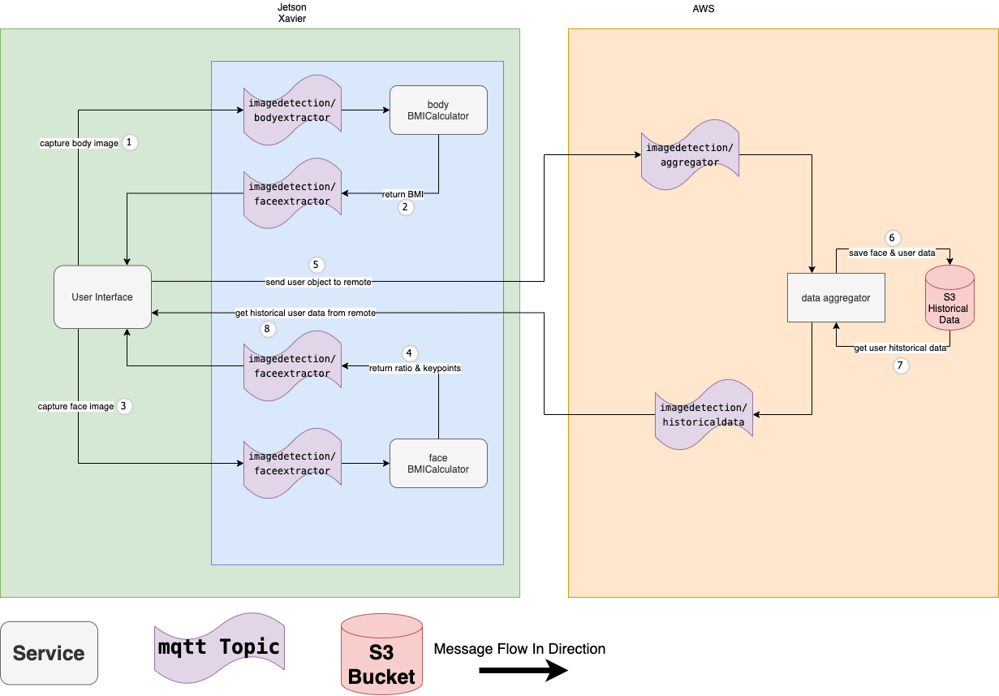

# Arhitecture Diagram
## Overall Design Diagram


## MQTT Topic Schema

### Sample message in 

* imagedetection/faceextractor: face image blob
```
x011,....
```
* imagedetection/bodyextractor: body image blob
```
x011,...
```

### Sample message in 

* imagedetection/faceextractor/result: integer, the bmi
```
24.03, 25, 21 
```
* imagedetection/bodyextractor/result: strintify json
```
{
    processed-image: x011....
    waist-height-ratio: 0.43
    hip-waist-ratio: 1.2
}
```

### Sample message in 

* imagedetection/aggregator: strintify json
```
{
    face-img : png_as_text
    bmi : 23.0
    waist-height-ratio : 0.47
    keypoints : [1,2,3,4,5]
    body-img : png_as_text
    session-id : str(uuid.uuid4())
}
```

* imagedetection/historicaldata: strintify json list
```
{'history': [{'date': '2020-12-6', 'bmi': 23.0, 'waist-height-ratio': 0.47}], 'session-id': '01e8334e-4e45-4c21-8cdc-60b370625010'}
```


## S3 Bucket Schema

## S3 Hierarchy
wait-watcher-bucket/  
* face-id/  
    * d-1/  
        * x011,x022..... (binary face image)  
    * id-2/  
        * x011,x022..... (binary face image)  
* user-historical-data/  
    * id-1/
        * year-month-day.json - User Object Json

## User Object Json Schema
```
{
    "bmi" : 23.01,
    "hip-waist-ratio" : 1.2
    "wait-height-ratio" : 0.45,
    "face" : x011,x022..... (binary face image), 
    "body" : x011,x022..... (binary body image),
    "timestamp" : 2020-12-04 12:34:908Z,
    "session-id" : uuid4 
}
```